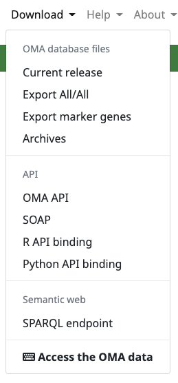
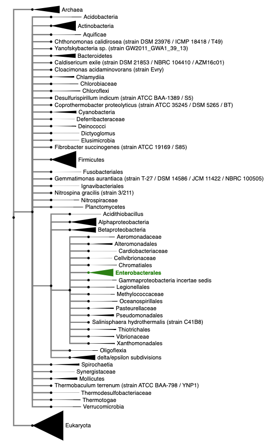
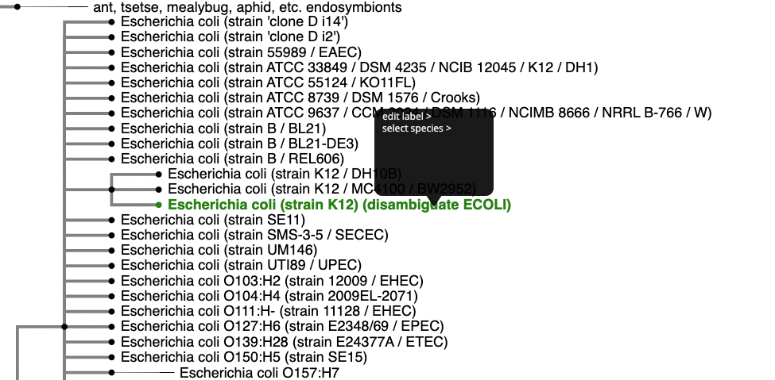
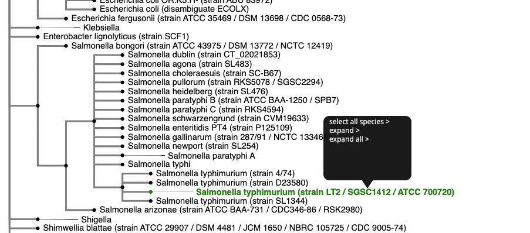
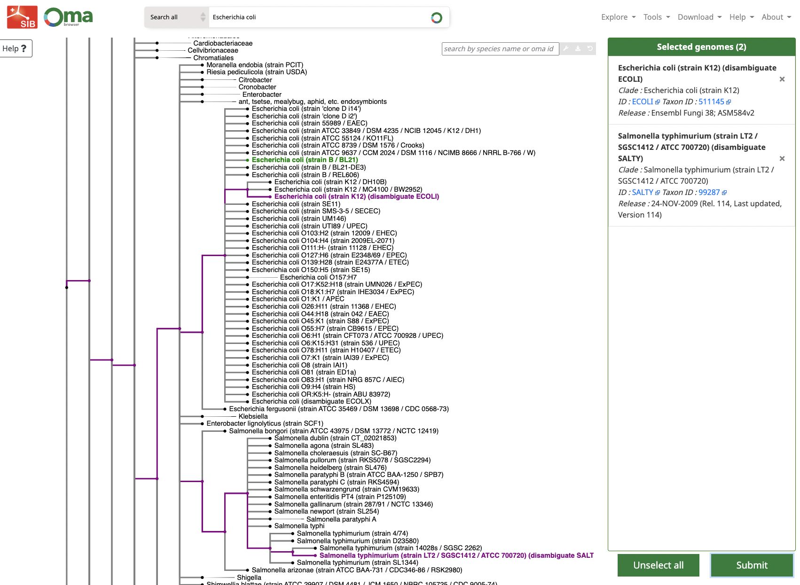
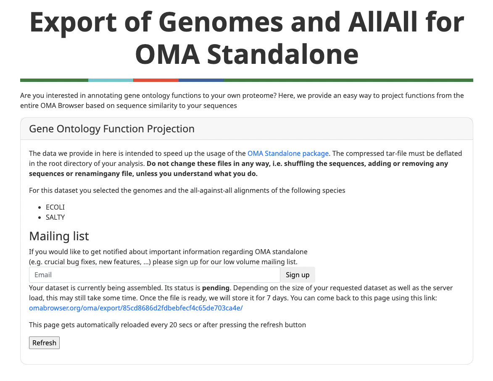

# A guide to generating individual SalmoNet2 (or analogous) networks

This guide serves as an extension of our publication focussing on generating interaction networks for non-model organisms, as our methodology has slightly changed since its inception.

What this guide covers:

- Exporting orthology data from the OMA Browser database
- Running OMA Standalone on a genome of interest
- Generating interaction layers based on the concept of interologs, from more-established organisms

## Exporting orthology data from the OMA Browser database

To export pre-computed orthology information fromt the OMA Browser datanbase, simply navigate to the **Download** option, and select Export All/All.

On the website, navigate to the model organisms of interest. In our case, we are going to use *E. coli* and *S.* Typhimurium LT2 to map our various orthology based interactions from.

Once selected, submit your selections to the website. The comparisons should be available soon.

## OMA Standalone
Once ready, download the All/All comparisons. Next, we are going to run OMA Standalone on the precomputed data to get the orthologous relationships.

Install OMA Standalone by following the instructions on the website (https://omabrowser.org/standalone/).

Once installed, all one has to do is navigate to the directory where the precomputed data was stored, and run the OMA Standalone software from your terminal software of choice, e.g. 

    cd my_directory
    OMA ./bin/oma

This is not going to take very long. Once completed, navigate to the Output folder, and take a look at the resulting files. We are going to deal with OrthologousGroups.txt, which lists the matching orthologs.

What we are going to have as a result is the orthologous proteins between **E. coli** an **S.** Typhimurium LT2. To include a genome of interest into the run, we are going to have to re-run OMA Standalone, with the addition of the new member.

In this guide I chose a **S.** Bovismorbificans proteome as an example: https://www.ncbi.nlm.nih.gov/data-hub/genome/GCF_016454185.1/, but any other similar proteome will work. Please note if you want to use DNA sequence data, you will have to change the run parameters in OMA Standalone accordingly (https://omabrowser.org/standalone/).

To re-run the OMA Standalone software simply place the .fa file of your choosing into the OMA/DB directory, and run the analysis similarly as above. This time it is going to take longer to execute, but thankfully only the relationships with the new member have to be calculated.

Once complete, you should see something very similar to what is included in the OMA folder of this GitHub repository (depending on your Salmonella genome/proteome of choice).

## Handling interaction data

Now that we have established the orthologous proteins, we can start generating interaction data for our strain of interest. In this tutorial we are going to show you how to map protein-protein interactions (PPIs) and how to generate enzyme-enzyme interactions from commonly used data formats. For more involved layers, such as the regulatory layer we recommend following the steps detailed in Olbei et al 2019, where we go into the details of constructing regulatory interactions (doi: http://dx.doi.org/10.1007/978-1-4939-9000-9_21). 

In this repository one can find two helper scripts to help deal with interaction data:

- salmonet2 psi-mitab converter: this tool helps you convert interaction files to a MITAB format. 
- salmonet2 ortholog mapper: this script maps MITAB interaction data based on the orthologous relationships generated by OMA Standalone. This is what you can use to generate interolog based interactions for your new strain.

The individual folders contain detailed readme files on both tools.

To map to your genome of choosing you might need to tinker a bit with the output of OMA Standalone and the scripts slightly.
First: to add the taxonomy ID of your selected strain open salmonet2_ortholog_mapper.py, and replace the number following the colon after *"EXTRA"*. This *EXTRA* is a catch-all used by our script to find the added strain of interest, as OMA uses five letter encodings for the strains it carries by default (e.g. ECOLI, SALTY). 
To make sure the script can find the proteins of interest we have to modify the output of OrthologousGroups.txt. If you open up the file the records look like the following. 

    OMA00001	Bovismorbificans_CVM_30176:WP_080105897.1 non-fimbrial adhesin SiiE [Salmonella enterica]	SALTY:SALTY04098 | AAL23085.1 | STM4261 | Q8ZKG6_SALTY; H9L4L9_SALTM; A0A1L1PTX3_SALER; A0A345JCZ6_SALET | Putative inner membrane protein
    OMA00002	Bovismorbificans_CVM_30176:WP_058799466.1 DUF823/DUF824 repeat adhesin RatB [Salmonella enterica]	SALTY:SALTY02423 | AAL21408.1 | STM2514 | Putative outer membrane protein
    OMA00003	Bovismorbificans_CVM_30176:WP_107251211.1 autotransporter adhesin BigA [Salmonella enterica]	SALTY:SALTY03353 | AAL22340.1 | STM3478 | Putative surface-exposed virulence protein bigA

First the OMA group identifier (OMA01234 format) followed by the various orthologous identifiers belonging to the same group. The five-letter identifier shows the organism, and after the comma various IDs are listed. Since our added strain is not part of OMA by default, we have to tell the ortholog mapper script what to look for.
The only change we have to make to the file is adding an 'EXTRA' prefix to our proteins to make sure the script finds it. This prefix can then removed later on when dealing with the data directly.

To do so use the Find / Replace function of your text editor of choice, or one can use the following shell script as well:

    sed -i -e 's/Bovismorbificans_CVM_30176:/Bovismorbificans_CVM_30176:EXTRA_/g' OrthologousGroups.txt

Once we are ready with this we can start mapping interactions between organisms.

## Mapping interactions between organisms

To map interactions between the selected strains, we are going to use two helper scripts to manage OMA data. 

First, if our input files are not in a mitab format, we can use the salmonet2_psi_mitab_converter.py to convert them into one. It takes .tsv files and converts them into the required format, including the output taxonomy ID's into their corresponding columns. For more information on the format please visit: https://github.com/HUPO-PSI/miTab/blob/master/PSI-MITAB27Format.md 
Further details can be found in the readme file included in the script fodler.

Below is an example running on the output of the metabolic layer:

    python3 salmonet2_psi_mitab_converter.py -i ../metabolic_layer/enzyme_enzyme_example.tsv -o ../metabolic_layer/enzyme_enzyme_example.mitab -hea -t 99287 -nc 0,1 -mc 0,1

To map the output between the strains we will use the salmonet2_ortholog_mapper.py script. This script uses the output of OMA (including the files we modified above!) to map identifiers from one organism to another.

Example 1: mapping filtered *E. coli* IntAct interactions to *S.* Bovismorbificans_CVM_30176

    python3 salmonet2_ortholog_mapper.py -i IntAct.mitab -m Map-SeqNum-ID.txt -of OrthologousGroups.txt -t 83333 -to 58097 -o example_files/IntAct_example.mitab

Example 2: mapping *S.* Typhimurium LT2 enzyme-enzyme interactions to *S.* Bovismorbificans_CVM_30176

     python3 salmonet2_ortholog_mapper.py -i ../metabolic_layer/enzyme_enzyme_example.mitab -m Map-SeqNum-ID.txt -of OrthologousGroups.txt -t 99287 -to 58097 -o example_files/EE_example.mitab

 
